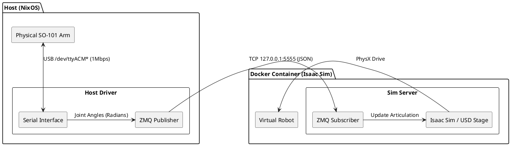

# Sim-to-Real Bridge Architecture

This document describes the ZeroMQ (ZMQ) based communication architecture used to bridge the physical SO-101 robotic arm (Host) and the Isaac Sim simulation (Container).

## Architecture Overview

The system is designed to decouple hardware drivers from the simulation environment. This allows for:
1.  **Easier Debugging**: Hardware drivers can be tested independently of the heavy simulation.
2.  **Environment Isolation**: Complex hardware dependencies (USB, Serial) stay on the Host, while the Simulation stays in a clean Container.
3.  **Flexibility**: The simulation can be replaced or restarted without reconnecting to the hardware.

### Data Flow



## Components

### 1. Host Driver (Client)
-   **Path**: `scripts/bridge/host_driver.py`
-   **Role**: Hardware Abstraction Layer.
-   **Function**:
    -   Connects to the physical robot via Serial (`/dev/ttyACM*`) using the Feetech STS/SCS protocol.
    -   Polls joint positions at high frequency (~100Hz+).
    -   Converts raw integer values (0-4096) to Radians.
    -   Publishes data as a JSON payload via a **ZMQ PUB** socket.
-   **Usage**:
    ```bash
    # Run with real hardware
    python3 scripts/bridge/host_driver.py --port /dev/ttyACM0

    # Run in Mock mode (generates sine waves)
    make bridge
    ```

### 2. Sim Server (Server)
-   **Path**: `scripts/bridge/sim_server.py`
-   **Role**: Simulation Controller.
-   **Function**:
    -   Runs inside the Isaac Sim container.
    -   Loads the robot USD asset (`assets/so101_follower.usd`) or a fallback (Franka).
    -   Subscribes to the **ZMQ SUB** socket on `localhost`.
    -   Applies received joint angles to the simulated robot using `ArticulationController`.
-   **Usage**:
    ```bash
    make sim
    ```

## Communication Protocol

-   **Transport**: ZeroMQ (TCP)
-   **Pattern**: Pub-Sub (Publisher-Subscriber)
-   **Address**: `tcp://127.0.0.1:5555`
-   **Payload Format**: JSON
    ```json
    {
      "timestamp": 1706789123.456,
      "joints": [0.12, -0.5, 1.2, 0.0, 0.0, 0.0]
    }
    ```
    -   `timestamp`: Unix timestamp (float).
    -   `joints`: Array of 6 floats representing joint angles in Radians.

## Hardware Setup (Host Side)

Ensure your user belongs to the `dialout` group to access serial ports:
```bash
sudo usermod -a -G dialout $USER
```

Verify the device is detected:
```bash
ls -l /dev/ttyACM*
```
